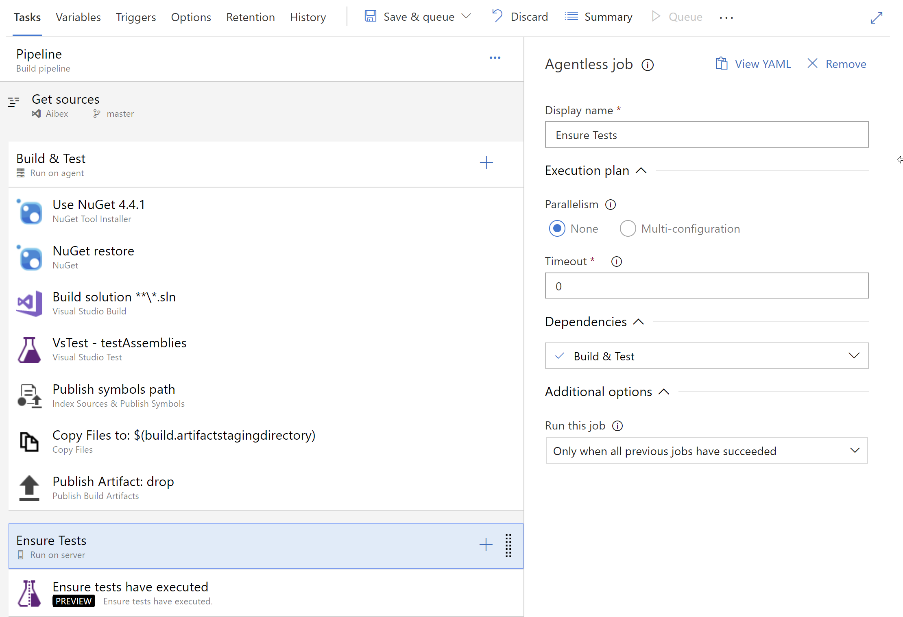

# Release Notes
> **2018-09-07**
> - Initial preview version

# Description

This extension provides a build task that allows you to quickly fail a build if it didn't execute any tests. This task uses "Server Phase". Be sure to set the dependency of this phase to the phases that run the tests.

# Documentation

Please check the [Wiki](https://github.com/jessehouwing/vsts-ensure-tests/wiki).

If you like this extension, please leave a review and feedback. If you'd have suggestions or an issue, please [file an issue to give me a chance to fix it](https://github.com/jessehouwing/vsts-ensure-tests/issues).
